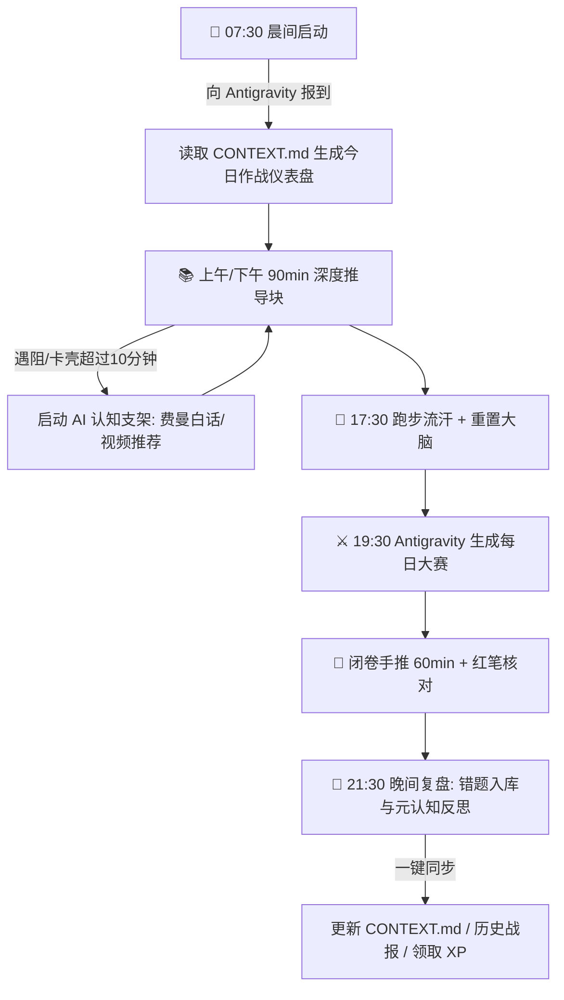

# 🤖 Antigravity & AI 辅助学习体系规范指南

> **定位**：Jerry 与 AI 导师（Antigravity / ChatGPT / Gemini）的日常协作工作契约与提示词母版库。  
> **核心宗旨**：利用 AI 彻底消灭启动阻力（Zero Friction），随时提供“认知支架（Scaffolding）”，让二战备考成为高反馈、低内耗的心流过程。

---

## 一、 AI 导师角色分工与作战场景

| AI 平台 | 核心定位 | 最佳使用场景 |
| :--- | :--- | :--- |
| **Antigravity** | **总指挥官 & 作战总参谋** | • 仓库文件管理、考纲对标、甘特图与进度核销<br>• 生成每日 LaTeX 实战大赛试卷与标准答案<br>• 日常任务调度、晚间元认知战报归档与段位晋升 |
| **ChatGPT / Claude** | **物理直觉与长难句拆解教练** | • 理论物理模型白话解释（“把角动量升降算符当成梯子解释给我听”）<br>• 考研英语长难句逐层剥离、四级薄弱者造句批改与作文润色<br>• 深度概念辨析与反直觉现象研讨 |
| **Gemini** | **多模态与全网视频资源雷达** | • 检索 B 站、网盘、YouTube、MIT 公开课中的对应章节优质精讲视频<br>• 公式手写草稿/草图的拍照辨识与计算纠错<br>• 快速提取考研真题与官方大纲的最新动态 |

---

## 二、 每日日常使用工作流 (Daily Standard Protocol)



### 1. 晨间启动（5分钟）
- **Prompt 指令**：
  > “请读取当前的 `CONTEXT.md`，帮我生成今天的作战仪表盘，包括今日核心任务、时间块划分和 XP 悬赏点。”

### 2. 学习遇阻卡壳（10分钟原则）
- **认知原则**：推导卡住允许硬抗 5~10 分钟（必要难度）；一旦超过 10 分钟仍无头绪，**立刻呼叫 AI 介入，禁止死磕导致内耗弃学！**
- **Prompt 指令模板见第三节**。

### 3. 晚间每日大赛发布
- **Prompt 指令**：
  > “请根据今日主控台安排，严格按照规范生成今日《每日大赛》（包含 604 高数反常积分 + 811 角动量代数 + 英语真题阅读切片）的 `.tex` 代码，并输出标准解析。”

### 4. 晚间复盘与战报同步
- **Prompt 指令**：
  > “我已完成今日大赛（得分 XX），复盘卡已记录错题。请帮我同步更新 `CONTEXT.md`、`00_Mission_Control_主控台.md` 与 `04_历史战报_Archive.md`，核算今日 XP 并检查是否触发段位晋升！”

---

## 三、 高效 AI 交互提示词母版库 (Prompt Arsenal)

### 模板 1：【理论物理·费曼白话直觉求助】
```markdown
【科目】：811 量子力学
【卡壳知识点】：[例如：角动量升降算符 L± 为什么作用在态上能改变磁量子数 m？]
【我的现状】：数学对易关系 [Lz, L±] = ±ħ L± 我推得出来，但脑子里完全没有物理图像。
【请你做】：
1. 用大白话和生活中的形象类比（比如梯子、陀螺、旋转转盘等），告诉我它在几何上到底代表什么。
2. 告诉我考研命题老师最喜欢在这里设置什么陷阱（计算避坑）。
3. 如果我想看 15-30 分钟精炼视频彻底搞懂，请推荐 B 站或网上最好的主讲老师和对应章节关键词。
```

### 模板 2：【高等数学·母题降维与视频导引】
```markdown
【科目】：604 高等数学
【薄弱题型】：[例如：反常积分的审敛法，尤其是瑕点在 0 和无穷大同时存在的拆分问题]
【请你做】：
1. 给出最精炼的“三步秒杀判断法则”和口诀，避免大段枯燥定理。
2. 精选 1 道国科大风格的典型母题，带我一步步手推，标出极易算错的细节。
3. 推荐 B 站最讲得透彻的考研老师（如武忠祥/张宇/宋浩等）对应讲解片段标题。
```

### 模板 3：【考研英语·四级 428 专属长难句手术】
```markdown
【科目】：201 考研英语（一）
【待拆解长难句】：[输入长难句原文]
【我的基础】：四级 428，从句套从句容易看晕，单词生僻。
【请你做】：
1. 第一步【主干手术】：只挑出主谓宾（核心骨架），给出一句极其简单的初中级白话中文。
2. 第二步【括号修饰】：把定语、状语、同位语用括号逐一括出，标明它们分别在“修饰谁”。
3. 第三步【熟词生义与高频生词】：提炼句中 2~3 个考研核心词，列出考研真题专属释义。
```

### 模板 4：【知识卡片生成指令】
```markdown
请根据我们刚才推导透彻的 [知识点名称]，严格按照仓库 `99_System_认知系统与模板/templates/tpl_高数定理与母题卡.md`（或量力模型卡）的模板规范，生成一张完整的 Markdown 知识卡片，必须包含【核心定义】、【费曼直觉解释】、【标准母题手撕】与【实战避坑手记】。
```

---

## 四、 推荐视频课程与名师导航雷达

| 科目 | 推荐名师 / 资源 | 适用场景与优势 | 检索关键词 |
| :--- | :--- | :--- | :--- |
| **811 量力** | **喀兴林《高等量子力学》/ 曾谨言配套讲座** | 概念严谨，契合国科大命题风格 | `曾谨言 量子力学 讲座` / `喀兴林` |
| **811 量力** | **中科大 史济怀 / 张永德 教授** | 算符代数与狄拉克符号讲解极其纯粹透彻 | `张永德 量子力学视频` / `中科大量子力学` |
| **811 量力** | **MIT 8.04 Quantum Physics (B站搬运)** | 图像化极强，专治数学推得懂但无物理直觉 | `MIT 8.04 量子物理 双语` |
| **604 高数** | **武忠祥（高数十七讲 / 选填技巧）** | 题型归纳极强，步骤规范，契合自命题计算大题 | `武忠祥 反常积分` / `武忠祥 极限` |
| **604 线代** | **李永乐（线代辅导讲义） / 3Blue1Brown** | 李永乐强化套路计算，3B1B 赋予矩阵几何直觉 | `李永乐 相似对角化` / `线性代数的本质 3B1B` |
| **201 英语** | **颉斌斌（阅读逻辑找线索） / 唐迟《阅读的逻辑》** | 专治四级基础薄弱者，不要求逐词看懂，凭逻辑主干做题 | `颉斌斌 考研英语阅读` / `唐迟 阅读的逻辑` |
| **201 英语** | **石雷鹏（带背带写功能作文）** | 考场直接默写功能句，防雷同，提分立竿见影 | `石雷鹏 考研英语作文 功能句` |
| **101 政治** | **腿姐（陆寓丰）点睛班 / 徐涛核心考案** | 逻辑清晰，马原框架好理解，适合碎片化刷课 | `腿姐 马原 框架` / `徐涛 考研政治` |
