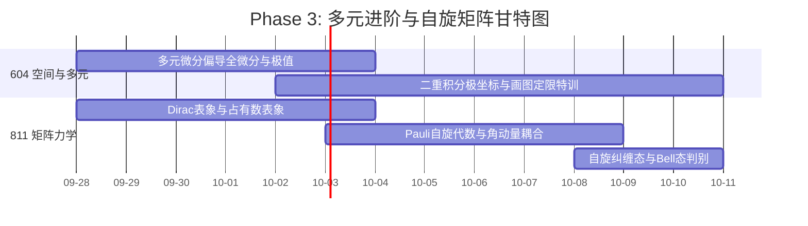

# Phase 3: 多元进阶与自旋矩阵 (Week 5-6)

> **时间段**：2026-09-28 ~ 2026-10-11
> **认知规律应用**：
> 1. **双重编码表征 (Dual-Coding)**：二重积分必须左脑算代数，右脑画几何定限图。
> 2. **交替穿插 (Interleaving)**：微积分画图与泡利矩阵乘法每天交替练习。

## 📈 本阶段专属微观推进甘特图

## 🎯 考纲严格映射与任务清单

### 【604 高等数学：空间几何与极值】
- [ ] **多元微分**：偏导数、全微分、方向导数/梯度计算；Lagrange乘数法。
- [ ] **二元 Taylor 公式 (考纲了解层次)**：结合 Hessian 矩阵判定极值。
- [ ] **二重积分**：直角与极坐标计算，**画图定限特训 (绝对重点)**。

### 【811 量子力学：矩阵力学觉醒】
- [ ] **Dirac 符号与表象**：表象变换、占有数表象引入。
- [ ] **自旋与角动量**：电子自旋、Pauli 矩阵代数、角动量耦合与 CG 系数。
- [ ] **前沿拓展 (考纲了解)**：**自旋纠缠态 (Bell 态) 与不可因式分解判别**。

## 🎁 多巴胺奖励触发器 (XP System)
- 二重积分画图定限连续 3 题全对，**+30 XP**。
- 默写 Pauli 矩阵全套对易与反对易关系，**+15 XP**。
