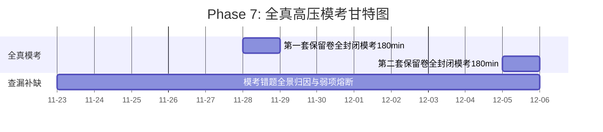

# Phase 7: 全真高压模考 (Week 13-14)

> **时间段**：2026-11-23 ~ 2026-12-06
> **心流机制**：进入极具挑战性的闭卷环境，模拟真实的生物钟与压力。

## 📈 本阶段专属微观推进甘特图

## 🎯 训练规范
- **180 分钟隔离测试**：每周末下午（对齐初试时间）进行 604/811 保留卷全真模拟。
- **时间管理训练**：学会在考场上战略性放弃极难计算，优先拿下所有基础分和步骤分。
- **双轨动量防御**：如果模考分数不理想，立即切入“保底防御模式”，通过简单的知识点默写重获掌控感，**严禁破罐破摔**。
