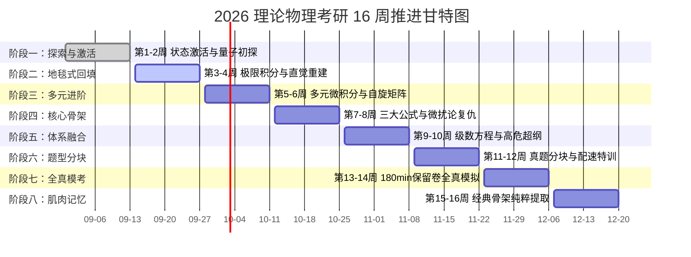

# 16 周宏观总览与考纲映射矩阵

> **功能定位**：本文件为全景视角的控制面板，用于快速查看宏观进度（甘特图）与考纲完成度。
> **详情指引**：关于每个阶段的具体“多巴胺奖励”、“回填任务”与“认知打法”，请进入 `16周宏观作战蓝图/` 目录查看对应阶段的独立文件。

> [!NOTE]
> ### 🧭 作战指挥中心·全系统全景互联导引
> 🚀 [[00_Mission_Control_主控台|00 今日作战主控台]] ｜ 🗺️ [[01_16周宏观总览与考纲映射_Milestones|01 16周总览与考纲甘特图]] ｜ 🎮 [[02_多巴胺成长系统_SkillTree|02 多巴胺技能树]]  
> 🔍 [[03_考纲核查报告与超纲防御|03 考纲核查与超纲防御]] ｜ 📜 [[04_历史战报与成长里程碑_Archive|04 历史战报与军衔长卷]] ｜ 🏆 [[05_每日大赛_Daily/每日大赛复盘索引_Index|每日大赛复盘索引]]

## 📈 16 周全景推进甘特图 (v3.0 科学重构版)

---

## 🎯 604 高等数学全局考纲核查表
*注：打勾表示已在《每日大赛》中形成稳定肌肉记忆，非走马观花。*
- [x] **极限与连续**：[[泰勒展开定阶与极限相消项]]、[[一元极限判定与不等式放缩度量]]、一致连续性（已在 9.13 满分检验）
- [x] **一元微分**：[[微分中值定理与辅助函数构造]]、泰勒公式与罗尔定理（已在 9.02 检验）
- [x] **一元积分**：[[定积分物理应用_弧长引力压力功]]、[[反常积分审敛法与高斯积分]]（已在 9.13 手撕高斯反常积分）
- [x] **多元微分**：[[二元Taylor公式与多元极值充分条件]]、[[多元微分极值与拉格朗日乘数法]]（已在 9.08 检验）
- [x] **重积分**：[[二重积分计算_直角极坐标与奇偶轮换对称]]（已在 9.11 满分检验）
- [x] **曲线曲面积分**：[[格林公式环量旋度与奇点挖洞法]]（已在 9.11 满分检验）
- [x] **级数与方程**：[[微分方程简单应用_增长衰变混合模型]]、一阶ODE变上限积分通解（已在 9.13 突破）
- [x] **线性代数**：[[实对称矩阵正交相似对角化与规范型]]、[[Cramer法则与行列式解方程组]]（已在 9.13 满分检验）

## 🎯 811 量子力学全局考纲核查表
*注：结合国科大历年真题 30 分大题的高危超纲点已融入。*
- [x] **波函数与薛定谔方程**：连续性方程概率守恒律、[[波函数动量空间傅里叶变换_物理图像]]（已在 9.13 突破）
- [x] **一维势场**：[[一维谐振子算符升降代数法]]、[[一维势垒贯穿与Gamow隧道效应]]、[[一维Delta势阱束缚态与导数跃度]]
- [x] **力学量算符**：[[Heisenberg图像与算符时间演化方程]]、谐振子算符牛二律对应（已在 9.13 满分检验）
- [x] **表象与图像**：[[算符指数与BCH展开_平移算符]]、[[Heisenberg图像与算符时间演化方程]]（已在 9.13 满分检验）
- [x] **中心力场**：[[氢原子简并度与SO4对称性]]、[[球形方势阱与三维各向同性谐振子]]
- [ ] **自旋与角动量**：[[自旋轨道耦合精细结构与超精细结构]]、[[自旋纠缠态Bell态与不可分辨判别]]（卡片已就绪）
- [x] **近似方法**：[[三维谐振子粒子数表象与多维微扰矩阵元]]（2015 压轴满分）、[[氦原子变分法基态能量近似]]、[[突发微扰_势场突变与谐振子频率跃变]]
- [ ] **多体系统**：全同粒子玻色/费米对称性、反常Zeeman效应与弱场分裂