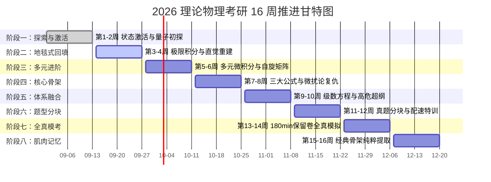

# 16 周宏观总览与考纲映射矩阵

> **功能定位**：本文件为全景视角的控制面板，用于快速查看宏观进度（甘特图）与考纲完成度。
> **详情指引**：关于每个阶段的具体“多巴胺奖励”、“回填任务”与“认知打法”，请进入 `16周宏观作战蓝图/` 目录查看对应阶段的独立文件。

## 📈 16 周全景推进甘特图 (v3.0 科学重构版)

---

## 🎯 604 高等数学全局考纲核查表
*注：打勾表示已在《每日大赛》中形成稳定肌肉记忆，非走马观花。*
- [ ] **极限与连续**：等价无穷小、泰勒定阶、洛必达、一致连续性
- [ ] **一元微分**：导数计算、微分中值定理构造、泰勒展开
- [ ] **一元积分**：不定积分技巧、定积分应用（弧长/功/引力）、反常积分审敛
- [ ] **多元微分**：偏导数、全微分、梯度、多元极值与 Hessian 矩阵
- [ ] **重积分**：二重积分极坐标、画图定限；三重积分柱面/球面坐标
- [ ] **曲线曲面积分**：第一/二类、三大公式（Green/Gauss/Stokes）
- [ ] **级数与方程**：敛散性判别、幂级数展开、傅里叶级数；一阶与常系数微分方程
- [ ] **线性代数**：行列式、矩阵秩、方程组解、特征值与实对称矩阵对角化、二次型

## 🎯 811 量子力学全局考纲核查表
*注：结合国科大历年真题 30 分大题的高危超纲点已融入。*
- [ ] **波函数与薛定谔方程**：概率解释、动量域波函数、概率流密度
- [ ] **一维势场**：无限深/有限深势阱、谐振子代数法、势垒贯穿
- [ ] **力学量算符**：厄米性、对易关系、共同本征态、Ehrenfest 定理
- [ ] **表象与图像**：Dirac 符号、Heisenberg 图像方程、算符指数与平移生成元
- [ ] **中心力场**：两体约化、氢原子径向方程、三维各向同性谐振子
- [ ] **自旋与角动量**：Pauli 矩阵、自旋轨道耦合、精细结构、CG系数、纠缠态
- [ ] **近似方法 (重中之重)**：非简并/简并微扰论、Hellmann-Feynman定理与Virial定理、变分法
- [ ] **多体系统**：全同粒子交换对称、电磁场中粒子 (Zeeman 效应)
