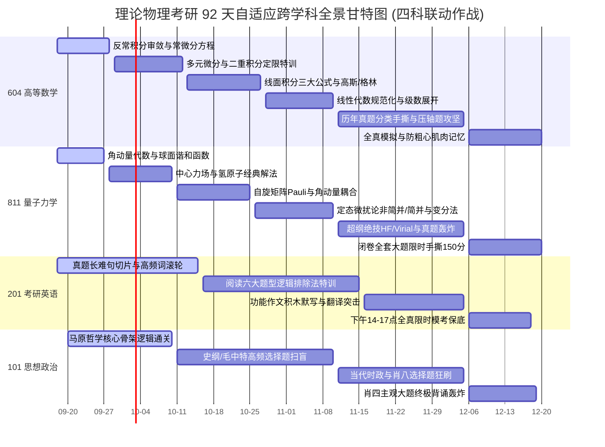

# 🗺️ 92 天自适应全景推进甘特图与考纲映射矩阵 (v4.0 动态里程碑版)

> **定位**：全局战略视角的控制面板，用于动态查看宏观进度（多科联动甘特图）与考纲达标度。  
> **核心机制**：**摒弃死板时间锁，全面实行“能力达标解锁制”**。某一模块白纸盲推通过率 $\ge 80\%$、每日大赛得分率 $\ge 75\%$ 即自动提前解锁下一模块。

> [!NOTE]
> ### 🧭 作战指挥中心·全系统全景互联导引
> 🚀 [[00_Mission_Control_主控台|00 今日作战主控台]] ｜ 🗺️ [[01_16周宏观总览与考纲映射_Milestones|01 92天甘特图与动态矩阵]] ｜ 🎮 [[02_多巴胺成长系统_SkillTree|02 多巴胺技能树]]  
> 🔍 [[03_考纲核查报告与超纲防御|03 考纲核查与超纲防御]] ｜ 📜 [[04_历史战报与成长里程碑_Archive|04 历史战报与军衔长卷]] ｜ 🏆 [[05_每日大赛_Daily/每日大赛复盘索引_Index|每日大赛复盘索引]] ｜ 🤖 [[00_AI协作规范与日常工作流|AI 协作规范指南]]

---

## 📈 92 天跨学科自适应甘特图 (2026-09-18 ~ 2026-12-20)

---

## 🚪 四大阶段能力达标解锁门槛 (Phase Gatekeepers)

### 阶段一：Phase A · 基础筑基与直觉回填（~10月10日前）
- **解锁条件**：
  - [ ] 604 高数：反常积分审敛法秒杀、一阶 ODE 变限通解无笔误、二重积分对称性运用自如。
  - [ ] 811 量力：角动量核心对易子 $[L_i, L_j]=i\hbar\epsilon_{ijk}L_k$ 闭卷默写、氢原子能量简并度推导完全无痛。
  - [ ] 201 英语：精读 10 篇真题阅读，手撕 20 句长难句主谓宾，消灭 100 个核心真题生词。
  - [ ] 101 政治：理顺马原辩证唯物主义与唯物史观逻辑框架。

### 阶段二：Phase B · 题型攻坚与模型进阶（10月11日 ~ 11月10日）
- **解锁条件**：
  - [ ] 604 高数：格林/高斯/斯托克斯三大公式奇点挖洞与投影法闭卷大题通过率 $\ge 80\%$。
  - [ ] 811 量力：简并微扰久期方程求解、自旋轨道耦合 $J=L+S$ 分裂大题稳拿 25 分以上。
  - [ ] 201 英语：近 10 年阅读题得分率稳定在 28-32 分（满分 40 分），长难句不再卡壳。
  - [ ] 101 政治：完成主流微信小程序刷题，选择题第一遍正确率 $\ge 65\%$。

### 阶段三：Phase C · 真题轰炸与超纲防御（11月11日 ~ 12月05日）
- **解锁条件**：
  - [ ] 国科大历年 604/811 真题（2013-2023）逐年手撕，掌握 HF 定理与 Virial 定理实战应用。
  - [ ] 英语小作文/大作文专属功能段落闭卷默写流利无拼写错误。
  - [ ] 政治肖八选择题均分稳定在 35+ 分。

### 阶段四：Phase D · 全真模考与肌肉记忆（12月06日 ~ 12月20日）
- **决胜目标**：全仿真考场环境，调理生物钟，稳定心态，笑傲初试，直通杭高院！

---

## 🎯 考纲与模型实时点亮清单

### 🧮 604 高等数学核心考点
- [x] **极限连续**：[[泰勒展开定阶与极限相消项]]、一致连续判定（9.13 满分验证）
- [x] **一元积分**：[[反常积分审敛法与高斯积分]]、[[定积分物理应用_弧长引力压力功]]
- [ ] **常微分方程**：可分离变量、一阶线性通解、全微分方程与 Bernoulli 方程
- [x] **多元微积分**：[[二元Taylor公式与多元极值充分条件]]、[[二重积分计算_直角极坐标与奇偶轮换对称]]
- [ ] **曲线曲面积分**：格林公式奇点挖洞、高斯公式补面、斯托克斯公式环量
- [x] **线性代数**：[[实对称矩阵正交相似对角化与规范型]]、[[Cramer法则与行列式解方程组]]

### 🌌 811 量子力学核心模型
- [x] **一维模型**：[[一维谐振子算符升降代数法]]、[[一维势垒贯穿与Gamow隧道效应]]、[[一维Delta势阱束缚态与导数跃度]]
- [x] **表象与演化**：[[Heisenberg图像与算符时间演化方程]]、[[算符指数与BCH展开_平移算符]]
- [ ] **角动量与空间**：角动量升降算符 $L_\pm$、球谐函数 $Y_{lm}$ 的空间节点、共同本征态 $|l, m\rangle$
- [x] **中心力场**：[[氢原子简并度与SO4对称性]]、[[球形方势阱与三维各向同性谐振子]]
- [ ] **自旋与纠缠**：Pauli 矩阵对易与性质、自旋单态/三重态、[[自旋纠缠态Bell态与不可分辨判别]]
- [x] **微扰与变分**：[[三维谐振子粒子数表象与多维微扰矩阵元]]、[[氦原子变分法基态能量近似]]、[[突发微扰_势场突变与谐振子频率跃变]]
- [ ] **超纲核心防御**：Hellmann-Feynman 定理、Virial 定理、圆环周期性边界简并态求解（高危大题必备）