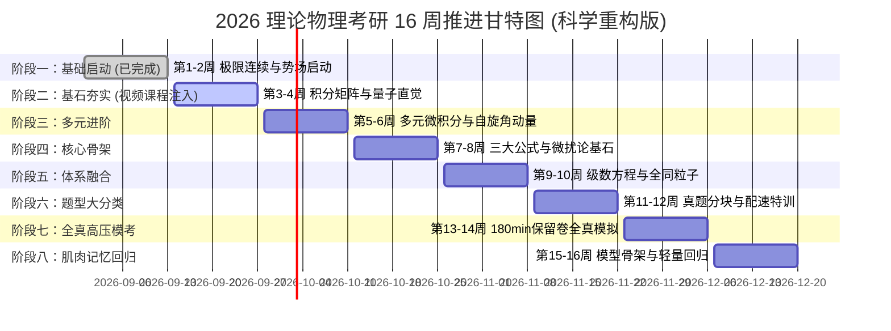

# 16 周科学阶段推进里程碑 (2026-08-31 ~ 2026-12-20)

> **最终目标**：中国科学院大学 (UCAS) / 杭州高等研究院 理论物理 (070201) 初试高分通关！  
> **初试倒计时**：决战 2026 年 12 月下旬（仅剩约 105 天）  
> **设计基准 (v2.0 重构版)**：基于顶级认知科学（交错学习、间隔重复、掌握学习），引入世界顶尖视频课程辅助，彻底告别“空中楼阁”。

---

## 📈 阶段里程碑交互打卡进度条

---

## 📺 顶级辅助外脑：视频课程弹药库 (按需调用)
- **量子力学直觉构建**：`YouTube: MIT 8.04 Quantum Physics I (Prof. Allan Adams)`。公认的地球上最好的量子力学入门课，极其注重物理图像而非死算。
- **线性代数终极真神**：`YouTube: MIT 18.06 Linear Algebra (Prof. Gilbert Strang)`。如果你觉得行列式、特征值只是抽象符号，Strang 教授会让你看到矩阵的灵魂。
- **微积分与线代可视化**：`YouTube: 3Blue1Brown (Essence of Calculus / Linear Algebra)`。吃饭时当爽剧看，建立绝对的几何直觉。

---

## 📋 16 周详尽任务清单与验收标准

### ✅【阶段一：基础诊断与势场启动】第 1-2 周（8.31 ~ 9.13）- 已完成！🎉
- [x] **604 高数**：函数、极限、连续；行列式计算与矩阵初等变换、秩；导数与微分。
- [x] **811 量力**：一维无限/有限深方势阱、势垒贯穿、$\delta$ 势；一维谐振子基础。
- [x] **成就解锁**：成功激活每日大赛体系，拿下 9.11 满分战绩；初步适应 AI 苏格拉底式教学。
- 🏆 **里程碑评价**：**完美开局**！成功克服了启动摩擦力，但在量子力学进阶时暴露出基础计算熟练度不足的问题，触发全面重构！

---

### 🔥【阶段二：基石夯实与量子直觉】第 3-4 周（9.14 ~ 9.27）
- [ ] **604 高数 (算力狂飙)**：定积分、不定积分、反常积分的绝对肌肉记忆（每日大赛 Section A 高频轰炸）；配合 MIT 18.06 攻克特征值与特征向量的基础计算。
- [ ] **811 量力 (直觉重建)**：全面引入 MIT 8.04 概念，每天 15 分钟“概念快问快答”。重点攻克算符厄米性、对易关系、概率流密度。暂时封印复杂的三维微扰论。
- [ ] **201 英语**：真题 2010-2012 基础精读，建立长难句拆解习惯。
- 🎯 **验收标准**：能在 3 分钟内无盲点解出常规积分题；能不假思索写出常见量子态的物理意义；完成 MIT 18.06 核心前 5 讲。

---

### 【阶段三：多元进阶与自旋矩阵】第 5-6 周（9.28 ~ 10.11）
- [ ] **604 高数**：多元函数微分学（偏导、全微分、方向导数/梯度、极值）；**二重积分（直角与极坐标计算，画图定限特训）**。
- [ ] **811 量力**：矩阵力学正式启动。电子自旋、Pauli 矩阵代数、轨道与总角动量、角动量耦合与 CG 系数。
- [ ] **201 英语**：真题 2013-2015 精读，提取 30 个真题熟词生义。
- 🎯 **验收标准**：Pauli 矩阵乘法形成本能反应；二重积分画图定限准确率 100%。

---

### 【阶段四：核心骨架与微扰论基石】第 7-8 周（10.12 ~ 10.25）
- [ ] **604 高数**：三重积分（柱面/球面坐标）；第一/二类曲线曲面积分、三大公式（Green/Gauss/Stokes）；实对称矩阵正交对角化。
- [ ] **811 量力**：重启定态微扰论（非简并与简并）。此时因为有了前两周的矩阵与积分地基，微扰论的久期方程将变得如同砍瓜切菜。引入变分法。
- [ ] **101 政治**：徐涛/腿姐强化班启动，马原哲学逻辑框架搭建。
- 🎯 **验收标准**：能够独立完整推导氢原子 $n=2$ 的线性斯塔克效应（解开 4x4 矩阵的封印）。

---

### 【阶段五：体系融合与全同粒子】第 9-10 周（10.26 ~ 11.08）
- [ ] **604 高数**：常数项级数审敛、幂级数展开、Fourier 级数；一阶/高阶常系数微分方程。
- [ ] **811 量力**：电磁场中粒子（规范不变性、Zeeman 效应）；全同粒子系统（交换对称、Bose/Fermi 统计）；含时微扰论基础。
- [ ] **101 政治**：毛中特、史纲框架串联。
- 🎯 **验收标准**：常微分方程能在 2 分钟内写出特征根通解；掌握全同粒子的波函数对称化方法。

---

### 【阶段六：真题分块与配速特训】第 11-12 周（11.09 ~ 11.22）
- [ ] **国科大真题爆破**：全面切入历年真题。按题型（势阱类、角动量类、微扰类、粒子流类）进行分类集训。
- [ ] **5 题专项配速**：针对 811 考研只有 5-6 道大题的特点，进行限时（每题 <= 30分钟）配速训练。
- [ ] **201 英语**：大小作文功能语料积木库搭建完毕并开始背诵。
- 🎯 **验收标准**：811 形成标准 5 题作答节奏，遇到不会的题能冷静分析对称性拿步骤分。

---

### 【阶段七：全真高压模考】第 13-14 周（11.23 ~ 12.06）
- [ ] **保留卷全真模拟**：每周末进行 180 分钟严格闭卷模考。上午考政治英语，下午考 604/811。查漏补缺，精修高频错题。
- [ ] **101 政治**：时政热点精背，肖八/肖四选择题狂刷。
- 🎯 **验收标准**：完整体验考场 180 分钟高压环境，彻底暴露并解决时间分配问题。

---

### 【阶段八：肌肉记忆回归】第 15-16 周（12.07 ~ 12.20）
- [ ] **基础大回归**：停止刷生题、怪题。只做最基础的积分、微分方程、泡利矩阵运算，保持手感。
- [ ] **考前默写**：空白纸重现经典物理模型骨架（氢原子能级、无穷深方势阱、一阶微扰公式、谐振子能级）。
- [ ] **全科状态调整**：调整作息与生物钟（上午 8:30 兴奋度），保持绝对自信！
- 🎯 **验收标准**：心如止水，从容奔赴考场！
