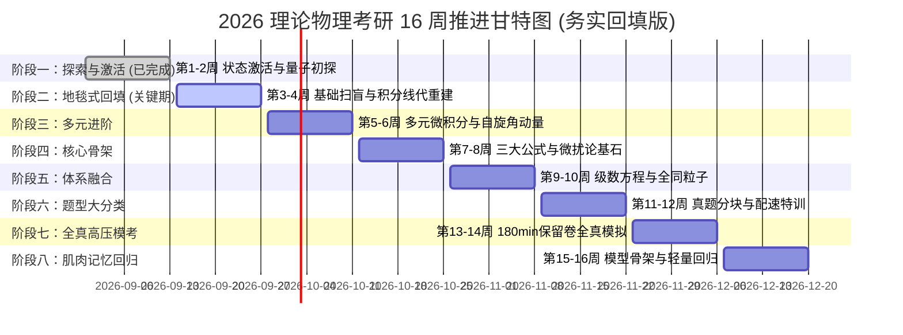

# 16 周科学阶段推进里程碑 (2026-08-31 ~ 2026-12-20)

> **最终目标**：中国科学院大学 (UCAS) / 杭州高等研究院 理论物理 (070201) 初试高分通关！  
> **初试倒计时**：决战 2026 年 12 月下旬（仅剩约 105 天）  
> **设计基准 (v2.1 务实回填版)**：基于顶级认知科学，引入顶尖视频课程。**绝不掩盖历史欠账**，将前两周未覆盖的盲区通过“每日基础矩阵”地毯式回填。

---

## 📈 阶段里程碑交互打卡进度条

---

## 📺 顶级辅助外脑：视频课程弹药库 (按需调用)
- **量子力学直觉构建**：`YouTube: MIT 8.04 Quantum Physics I (Prof. Allan Adams)`。注重物理图像而非死算。
- **线性代数终极真神**：`YouTube: MIT 18.06 Linear Algebra (Prof. Gilbert Strang)`。透视矩阵灵魂。
- **微积分与线代可视化**：`YouTube: 3Blue1Brown`。建立绝对的几何直觉。

---

## 📋 16 周详尽任务清单与验收标准

### ✅【阶段一：探索与激活】第 1-2 周（8.31 ~ 9.13）- 里程碑达成
- **实际战果**：
  - **量子力学**：初步接触了一维无限深方势阱、谐振子升降算符概念、以及部分微扰论思想，成功激活了大脑对量子力学符号的适应力。
  - **状态激活**：跑通了每日大赛的闭环流程，拿到了满分体验，建立起了考研的备战节奏。
- **历史遗留（需在后续回填）**：604高数的极限、连续、基础导数；线代的基础行列式计算；811量子的大部分细节推导（如含时薛定谔方程的物理意义）。
- 🏆 **里程碑评价**：成功克服了长线备考的初始静摩擦力！虽然知识有断层，但“不怕做题”的心态已经建立，这是无价的。

---

### 🔥【阶段二：地毯式基础回填】第 3-4 周（9.14 ~ 9.27）
- **战略重心**：**“还债与筑基”**。把前两周跳过的基础，通过《每日大赛》的 Section A 强行补齐。
- [ ] **604 高数 (回填扫盲)**：从**极限计算（洛必达/泰勒展开）**和**基础导数/积分公式**开始，确保没有任何高中或大一的基础漏洞。同时配合 MIT 18.06 从头建立矩阵运算的直觉。
- [ ] **811 量力 (直觉重建)**：全面引入 MIT 8.04 概念。每天的 Section B 将测试最基础的概念（如：波函数的统计解释到底是什么？）。暂时封印复杂的微扰论计算。
- [ ] **201 英语**：真题 2010-2012 基础精读。
- 🎯 **验收标准**：做到没有任何基础积分、极限题能卡住你，填补前两周留下的知识盲区。

---

### 【阶段三：多元进阶与自旋矩阵】第 5-6 周（9.28 ~ 10.11）
- [ ] **604 高数**：多元函数微分学（偏导、方向导数/梯度）；二重积分（直角与极坐标计算，画图定限特训）。
- [ ] **811 量力**：矩阵力学正式启动。电子自旋、Pauli 矩阵代数、角动量耦合与 CG 系数。
- 🎯 **验收标准**：Pauli 矩阵乘法形成本能反应；二重积分画图定限准确率 100%。

---

### 【阶段四：核心骨架与微扰论复仇】第 7-8 周（10.12 ~ 10.25）
- [ ] **604 高数**：三重积分；第一/二类曲线曲面积分、三大公式；实对称矩阵正交对角化。
- [ ] **811 量力**：**重启微扰论！** 在有了极其扎实的微积分和矩阵基础后，重新挑战简并与非简并微扰论。你会发现之前觉得像天书的久期方程，现在如同砍瓜切菜。
- 🎯 **验收标准**：能够独立完整推导氢原子 $n=2$ 的线性斯塔克效应（彻底解开 4x4 矩阵的封印）。

---

### 【阶段五：体系融合与全同粒子】第 9-10 周（10.26 ~ 11.08）
- [ ] **604 高数**：常数项级数审敛、幂级数展开、Fourier 级数；常系数微分方程。
- [ ] **811 量力**：电磁场中粒子；全同粒子系统；含时微扰论基础。
- 🎯 **验收标准**：常微分方程能在 2 分钟内写出特征根通解。

---

### 【阶段六：真题分块与配速特训】第 11-12 周（11.09 ~ 11.22）
- [ ] **国科大真题爆破**：全面切入历年真题。按题型（势阱类、角动量类、微扰类）分类集训。
- [ ] **5 题专项配速**：针对 811 考研只有 5-6 道大题的特点，限时（每题 <= 30分钟）配速训练。
- 🎯 **验收标准**：811 形成标准作答节奏，遇到不会的题能冷静分析拿步骤分。

---

### 【阶段七：全真高压模考】第 13-14 周（11.23 ~ 12.06）
- [ ] **保留卷全真模拟**：每周末进行 180 分钟严格闭卷模考。下午考 604/811。查漏补缺。
- 🎯 **验收标准**：完整体验考场 180 分钟高压环境，彻底暴露并解决时间分配问题。

---

### 【阶段八：肌肉记忆回归】第 15-16 周（12.07 ~ 12.20）
- [ ] **基础大回归**：停止刷生题。只做最基础的积分、微分方程、泡利矩阵运算。
- [ ] **考前默写**：空白纸重现经典物理模型骨架。
- 🎯 **验收标准**：心如止水，从容奔赴考场！
