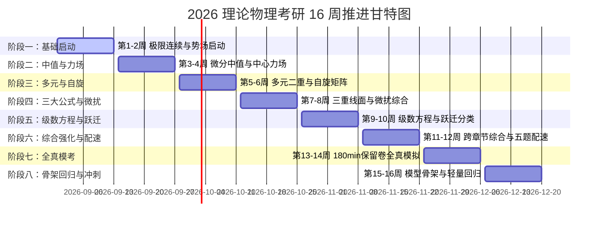

# 16 周科学阶段推进里程碑（2026-08-31 至 2026-12-20）

> **当前周期**：2026 年秋季考研攻坚季（初试时间：2026 年 12 月下旬）  
> **设计基准**：对齐国科大 604（微积分+线代）与 811（量子力学）考纲，平衡认知负荷。

---

## 📈 阶段里程碑交互打卡进度条

---

## 📋 16 周详尽任务清单与验收标准

### 【阶段一：基础诊断与势场启动】第 1–2 周（8.31 – 9.13）
- [ ] **604 高数**：函数、极限、连续（等价无穷小相消/泰勒展开定阶）；行列式计算与矩阵初等变换、矩阵的秩；导数与微分。
- [x] **811 量力**：一维无限/有限深方势阱、势垒贯穿、$\delta$ 势；一维谐振子（算符升降代数法与 Hermite 多项式）。
- [ ] **201 英语**：真题 2010-2012 基础精读，建立长难句拆解习惯。
- 🎯 **验收标准**：完成两科首轮基础摸底，攻克 604 极限相消项展开与 811 势场本征态求解。

---

### 【阶段二：微分中值与中心力场】第 3–4 周（9.14 – 9.27）
- [ ] **604 高数**：微分中值定理（Rolle/Lagrange/Cauchy）、Taylor 公式；不定/定积分、反常积分审敛；空间直线与平面、二次曲面。
- [ ] **811 量力**：算符厄米性、测量概率、对易子与守恒量、Ehrenfest 定理；中心力场、两体约化、氢原子求解与物理图像。
- [ ] **201 英语**：真题 2013-2015 精读，提炼 30 个真题熟词生义。
- 🎯 **验收标准**：掌握高数微分构造辅助函数与反常积分审敛法；攻克氢原子能级与径向波函数物理图像。

---

### 【阶段三：多元二重与自旋矩阵】第 5–6 周（9.28 – 10.11）
- [ ] **604 高数**：多元函数微分学（偏导/全微分/方向导数/梯度/极值/Lagrange乘数法）；**二重积分（直角与极坐标计算）**；线性方程组解的结构与通解。
- [ ] **811 量力**：矩阵表象与 Dirac 符号（表象变换、占有数表象）；电子自旋、Pauli 矩阵代数、轨道与总角动量、角动量耦合与 CG 系数。
- [ ] **201 英语**：真题 2016-2018 精读，归纳阅读理解 6 大题型逻辑。
- 🎯 **验收标准**：突破空间多元极值与二重积分计算；熟练运用 Pauli 矩阵与角动量耦合代数。

---

### 【阶段四：三重线面与微扰综合】第 7–8 周（10.12 – 10.25）
- [ ] **604 高数**：三重积分（柱面/球面坐标）；第一/二类曲线曲面积分、三大公式（Green/Gauss/Stokes）、散度旋度；**特征值与实对称矩阵正交对角化、二次型标准化与正定性**。
- [ ] **811 量力**：电磁场中粒子（规范不变性、Zeeman 效应、Landau 能级）；全同粒子系统（交换对称、Bose/Fermi 统计）；定态微扰论（非简并与简并）与变分法。
- [ ] **201 英语**：真题 2019-2020 精读，开始搭建大小作文功能语料积木库。
- 🎯 **验收标准**：**第 8 周末各完成一套 180 分钟基线真题测试**；攻克线面积分与微扰矩阵元构建。

---

### 【阶段五：级数方程与跃迁分类】第 9–10 周（10.26 – 11.08）
- [ ] **604 高数**：常数项级数审敛、幂级数收敛域/和函数与展开、Fourier 级数；一阶/高阶常系数微分方程与 Euler 方程。
- [ ] **811 量力**：含时微扰论、突发与绝热微扰、量子跃迁概率与 Fermi 黄金规则；**811 真题分类专题突破（势场/算符/角动量/微扰）**。
- [ ] **101 政治**：马原哲学与政治经济学选择题全通，毛中特/史纲框架串联。
- 🎯 **验收标准**：形成高数级数求和解题套路；系统分类归纳 811 真题必考题型。

---

### 【阶段六：综合强化与五题配速】第 11–12 周（11.09 – 11.22）
- [ ] **604 高数**：跨章节综合强化（微积分综合题、线代全板块循环维护）；限时计算攻坚。
- [ ] **811 量力**：811 综合大题（中心力场+微扰+跃迁、磁场+自旋耦合）；**5 题专项限时配速训练（每周一套整卷，每题 $\le 30$ min）**。
- [ ] **201 英语**：真题 2021-2023 近年卷模考，固定做题顺序与时间分配。
- 🎯 **验收标准**：811 形成标准 5 题作答节奏（整卷稳在 150–160 min 内）；604 跨章节综合求解稳定。

---

### 【阶段七：保留卷全真模拟】第 13–14 周（11.23 – 12.06）
- [ ] **604 高数**：**预留保留卷全真模拟（180分钟严格闭卷）**；查漏补缺，精修高频错题。
- [ ] **811 量力**：**预留保留卷全真模拟（180分钟严格闭卷）**；针对薄弱模块组织一次半日双科联考。
- [ ] **101 政治**：时政热点精背，肖四/徐六等名师预测卷选择题狂刷。
- 🎯 **验收标准**：完整体验考场 180 分钟高压环境，固化答题时间分配与审题/检查策略。

---

### 【阶段八：模型骨架与轻量回归】第 15–16 周（12.07 – 12.20）
- [ ] **604 高数**：轻量限时练习；默写核心定理条件与展开公式；复盘易错计算步骤。
- [ ] **811 量力**：空白纸重现经典物理模型骨架；**停止刷生题与新资料**。
- [ ] **全科状态**：调整作息与生物钟（上午 8:30 兴奋度），保持强大自信！
- 🎯 **验收标准**：熟记物理常数、经典公式与推导核心要点，稳定考场心态，从容奔赴考场！
