# 🎮 理论物理学神多巴胺成长系统 (Skill Tree & XP Engine)

> **设计原理**：基于神经生物学**多巴胺奖赏预测误差 (Reward Prediction Error)** 与**游戏化机制 (Gamification)**。  
> 考研不是无休止的折磨，而是一场解锁物理宇宙真理与智力进阶的史诗 RPG！

---

## 🎖️ 一、 理论物理学者进阶段位体系

| 等级 | 段位称号 | 累计经验值 (XP) | 解锁特权 / 里程碑标志 |
| :---: | :--- | :---: | :--- |
| **Lv 1** | **测不准萌新 (Uncertainty Initiate)** | 0 - 300 XP | 开启备战，建立第一个知识卡片与长难句拆解 |
| **Lv 2** | **谐振子学徒 (Harmonic Apprentice)** | 301 - 800 XP | 熟练推导一维势场与升降算符，极限展开不出错 |
| **Lv 3** | **氢原子探路者 (Hydrogen Explorer)** | 801 - 1800 XP | 攻克中心力场与径向波函数，高数多元与线代通关 |
| **Lv 4** | **角动量耦合大师 (Angular Momentum Adept)** | 1801 - 3500 XP | Pauli 自旋与 CG 系数运用自如，线面积分三大公式全通 |
| **Lv 5** | **微扰跃迁宗师 (Perturbation Master)** | 3501 - 6000 XP | 简并微扰与 Fermi 黄金规则纯熟，英语阅读破 34 分 |
| **Lv 6** | **国科大杭高院研士候选人 (UCAS Fellow)** | 6000+ XP | 模考稳定 360+，从容笑傲考场，奔赴杭高院！ |

---

## 💎 二、 每日经验值 (XP) 获取规则手册

### 1. 知识储备卡片沉淀 (Input & Elaboration)
- [ ] 完整建立 1 篇**高数定理母题卡**并写出费曼白话解释：`+25 XP`
- [ ] 完整建立 1 篇**量子力学模型卡**手推断点：`+30 XP`
- [ ] 规范手撕 1 篇**考研英语长难句**（剥离主干+修饰拆解+学术翻译）：`+20 XP`
- [ ] 归纳 5 个**真题语境熟词生义**：`+15 XP`

### 2. 输出实战与每日大赛 (Output & Testing)
- [ ] 完成当日**每日大赛**（闭卷手推 M1 + Q1）：`+50 XP`
- [ ] 完成当日**5 大错因复盘并写出反思顿悟**：`+20 XP`
- [ ] 当日 M1 或 Q1 规范推导一次性满分（零笔误）：`+30 XP (暴击奖赏)`

### 3. 习惯与动量防御 (Momentum & Habits)
- [ ] 连续 3 天完成【标准推进轨】：`+50 XP (连胜奖励)`
- [ ] 遇到状态低谷，启动【保底防御轨】坚决不破罐破摔：`+40 XP (坚韧护盾)`
- [ ] 睡前填写【蔡格尼克次日预挂钩】：`+10 XP`

---

## 🌳 三、 四大学科核心技能树 (Skill Tree)

```mermaid
graph TD
    subgraph 604 高等数学技能树
        A1[极限相消与泰勒定阶] --> A2[微分中值构造法]
        A2 --> A3[反常积分审敛换元]
        A3 --> A4[二重三重对称性降维]
        A4 --> A5[Green/Gauss/Stokes三大公式]
        A5 --> A6[实对称矩阵正交相似对角化]
    end

    subgraph 811 量子力学技能树
        B1[无限/有限势阱本征解] --> B2[一维谐振子算符升降代数]
        B2 --> B3[算符对易与Ehrenfest定理]
        B3 --> B4[氢原子径向方程与能谱]
        B4 --> B5[Pauli矩阵与角动量CG耦合]
        B5 --> B6[定态微扰/变分法与Fermi黄金规则]
    end

    subgraph 201 考研英语技能树
        C1[长难句主谓宾快速剥离] --> C2[熟词生义与隐蔽考法辨析]
        C2 --> C3[阅读六大题型干扰项排除]
        C3 --> C4[模块化大小作文论据积木库]
    end
```

---

## 🛡️ 四、 连胜防御勋章与心流保护牌

- **动量防御金牌 (Momentum Shield)**：
  - 每当你觉得“今天好累，什么都不想学”的时候，只要你在桌前静坐 20 分钟推导一个物理模型，你就保住了你的学习动量！
- **战功记录板 (Progress Log)**：
  - 在每一次获得重大灵感（Aha Moment）时，在对应的知识卡片下方记下一句自己的话。考前翻阅，满满都是自己战斗过的痕迹！
