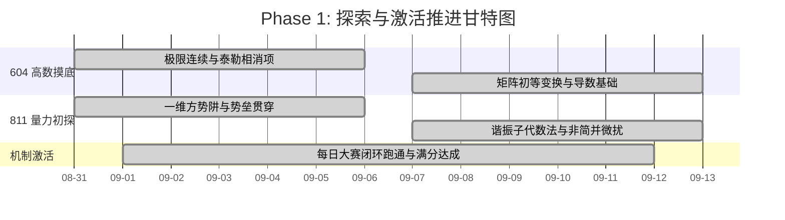

# Phase 1: 探索与激活 (Week 1-2)

> **时间段**：2026-08-31 ~ 2026-09-13 (已结束)

> [!NOTE]
> ### 🧭 作战指挥中心·全系统全景互联导引
> 🚀 [[00_Mission_Control_主控台|00 今日作战主控台]] ｜ 🗺️ [[01_16周宏观总览与考纲映射_Milestones|01 16周总览与考纲甘特图]] ｜ 🎮 [[02_多巴胺成长系统_SkillTree|02 多巴胺技能树]]  
> 🔍 [[03_考纲核查报告与超纲防御|03 考纲核查与超纲防御]] ｜ 📜 [[04_历史战报与成长里程碑_Archive|04 历史战报与军衔长卷]] ｜ 🏆 [[05_每日大赛_Daily/每日大赛复盘索引_Index|每日大赛复盘索引]]

> **阶段状态**：✅ **已完成 (激活成功)**
> **认知与多巴胺机制**：克服初始静摩擦力，体验“每日闭环”带来的微小成就感（+50 XP 每日结算）。

## 📈 本阶段专属微观推进甘特图

## 🎯 实际达成与历史战绩
- **状态激活**：成功跑通了每日大赛的闭环流程，拿到了满分体验，建立起了考研的备战节奏。
- **量子力学 (811) 初探**：一维无限深方势阱本征态推导、谐振子升降算符基础概念。
- **高等数学 (604) 初探**：部分微积分复习，但遗留了较多计算生疏问题。

## ⚠️ 遗留欠账 (向下移交至 Phase 2 回填)
- **604 遗留**：极限的系统性计算（洛必达、泰勒相消）；反常积分敛散性；行列式基础。
- **811 遗留**：含时薛定谔方程的物理图景与概率流；算符厄米性与对易关系。