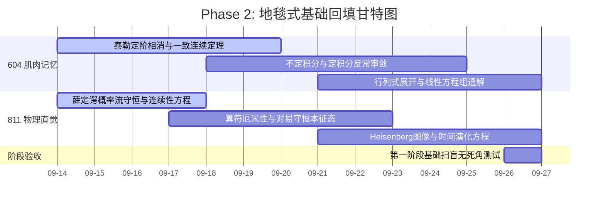

# Phase 2: 地毯式基础回填 (Week 3-4)

> **时间段**：2026-09-14 ~ 2026-09-27 (当前执行中)

> [!NOTE]
> ### 🧭 作战指挥中心·全系统全景互联导引
> 🚀 [[00_Mission_Control_主控台|00 今日作战主控台]] ｜ 🗺️ [[01_16周宏观总览与考纲映射_Milestones|01 16周总览与考纲甘特图]] ｜ 🎮 [[02_多巴胺成长系统_SkillTree|02 多巴胺技能树]]  
> 🔍 [[03_考纲核查报告与超纲防御|03 考纲核查与超纲防御]] ｜ 📜 [[04_历史战报与成长里程碑_Archive|04 历史战报与军衔长卷]] ｜ 🏆 [[05_每日大赛_Daily/每日大赛复盘索引_Index|每日大赛复盘索引]]

> **阶段核心**：**还债与筑基。绝对不允许在基础不牢的情况下突进！**
> **认知规律应用**：
> 1. **掌握学习 (Mastery Learning)**：必须在白纸上无盲点解出常规积分，否则不准进入下一步。
> 2. **必要难度 (Desirable Difficulties)**：限制时间的高强度基础计算。

## 📈 本阶段专属微观推进甘特图

## 🎯 考纲严格映射与任务清单

### 【604 高等数学：肌肉记忆重建】
*配合 MIT 18.06 与 3B1B，建立降维打击直觉*
- [x] **极限与连续**：洛必达法则、泰勒公式定阶相消（重点攻克佩亚诺余项）；**一致连续性判定与闭区间均匀覆盖定理 (考纲要求补齐)**。
- [ ] **微积分计算**：不定积分、定积分、反常积分审敛。
- [ ] **线性代数基础**：行列式计算、Cramer 法则解方程组、矩阵初等变换。

### 【811 量子力学：直觉降维与补漏】
*配合 MIT 8.04 概念闪击，全面退回物理图像，暂停复杂微扰。*
- [ ] **物理图像回填**：薛定谔方程的物理意义、概率流密度守恒。
- [ ] **算符代数 (考纲必须)**：算符厄米性证明、对易关系与共同本征态。
- [ ] **图像理论 (考纲必考)**：**Schrödinger 图像 vs Heisenberg 图像**（方程推导与平移算符初探）。

## 🎁 多巴胺奖励触发器 (XP System)
- 独立完成一道泰勒展开无错大题，**+10 XP**。
- 用费曼白话向 AI 解释清楚 Heisenberg 图像，**+20 XP**。
- 完成每日大赛基础矩阵回填，**+50 XP**。