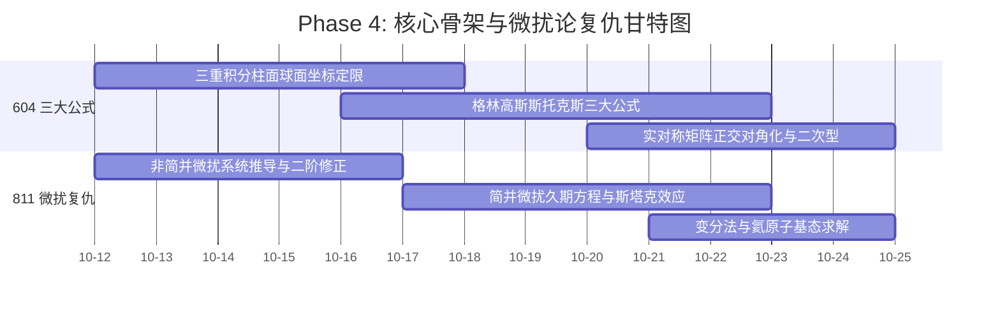

# Phase 4: 核心骨架与微扰论复仇 (Week 7-8)

> **时间段**：2026-10-12 ~ 2026-10-25

> [!NOTE]
> ### 🧭 作战指挥中心·全系统全景互联导引
> 🚀 [[00_Mission_Control_主控台|00 今日作战主控台]] ｜ 🗺️ [[01_16周宏观总览与考纲映射_Milestones|01 16周总览与考纲甘特图]] ｜ 🎮 [[02_多巴胺成长系统_SkillTree|02 多巴胺技能树]]  
> 🔍 [[03_考纲核查报告与超纲防御|03 考纲核查与超纲防御]] ｜ 📜 [[04_历史战报与成长里程碑_Archive|04 历史战报与军衔长卷]] ｜ 🏆 [[05_每日大赛_Daily/每日大赛复盘索引_Index|每日大赛复盘索引]]

> **认知规律应用**：
> 1. **间隔提取 (Spaced Retrieval)**：唤醒 Phase 1 的微扰论记忆，此时有了 Phase 2/3 的积分和矩阵基础，将势如破竹。

## 📈 本阶段专属微观推进甘特图

## 🎯 考纲严格映射与任务清单

### 【604 高等数学：三大公式与线代巅峰】
- [ ] **三重积分**：柱面/球面坐标系。
- [ ] **曲线曲面积分与三大公式**：Green / Gauss / Stokes 公式（重点强调几何拓扑意义，白纸盲推格林奇点）。
- [ ] **实对称矩阵**：正交对角化、二次型标准化。

### 【811 量子力学：微扰论全面复仇】
- [ ] **定态微扰论**：非简并与简并（久期方程与特征值求解）。
- [ ] **氢原子斯塔克效应**：$n=2$ 线性 Stark 效应（解开 4x4 矩阵封印）。
- [ ] **近似方法 (考纲要求补齐)**：**氦原子和氢分子的变分法近似求解**。

## 🎁 多巴胺奖励触发器 (XP System)
- 独立算出 4x4 久期方程的能量分裂，**+100 XP (史诗级成就)**。