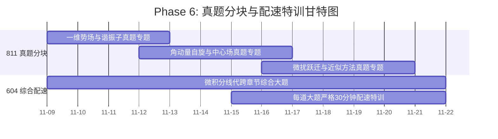

# Phase 6: 真题分块特训 (Week 11-12)

> **时间段**：2026-11-09 ~ 2026-11-22

> [!NOTE]
> ### 🧭 作战指挥中心·全系统全景互联导引
> 🚀 [[00_Mission_Control_主控台|00 今日作战主控台]] ｜ 🗺️ [[01_16周宏观总览与考纲映射_Milestones|01 16周总览与考纲甘特图]] ｜ 🎮 [[02_多巴胺成长系统_SkillTree|02 多巴胺技能树]]  
> 🔍 [[03_考纲核查报告与超纲防御|03 考纲核查与超纲防御]] ｜ 📜 [[04_历史战报与成长里程碑_Archive|04 历史战报与军衔长卷]] ｜ 🏆 [[05_每日大赛_Daily/每日大赛复盘索引_Index|每日大赛复盘索引]]

> **认知规律应用**：
> 1. **组块化 (Chunking)**：不再按年份盲目刷题，而是把真题拆解为“势场类”、“角动量类”、“微扰类”等模型组块，集中轰炸。

## 📈 本阶段专属微观推进甘特图

## 🎯 训练规范
- **811 专项配速**：针对国科大只有 5-6 道大题的特点，进行每题严格 $\le 30$ 分钟的限时手撕。
- **604 跨章综合**：训练对综合题目（如积分与微分方程结合、线代与空间几何结合）的模式识别能力。
- **错题熔断机制**：任何在真题中连续算错两次的积分/矩阵，立刻触发熔断，退回 Phase 2 进行专项肌肉记忆训练。