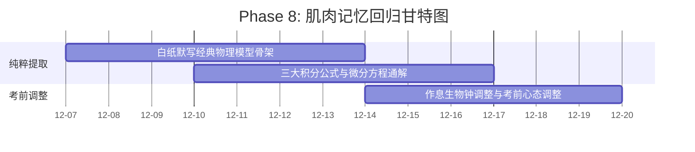

# Phase 8: 肌肉记忆回归 (Week 15-16)

> **时间段**：2026-12-07 ~ 2026-12-20

> [!NOTE]
> ### 🧭 作战指挥中心·全系统全景互联导引
> 🚀 [[00_Mission_Control_主控台|00 今日作战主控台]] ｜ 🗺️ [[01_16周宏观总览与考纲映射_Milestones|01 16周总览与考纲甘特图]] ｜ 🎮 [[02_多巴胺成长系统_SkillTree|02 多巴胺技能树]]  
> 🔍 [[03_考纲核查报告与超纲防御|03 考纲核查与超纲防御]] ｜ 📜 [[04_历史战报与成长里程碑_Archive|04 历史战报与军衔长卷]] ｜ 🏆 [[05_每日大赛_Daily/每日大赛复盘索引_Index|每日大赛复盘索引]]

> **核心原则**：停止吸收新知识！纯粹的提取练习 (Active Recall)。

## 📈 本阶段专属微观推进甘特图

## 🎯 考前最后冲刺指南
- **封印生题怪题**：拒绝一切没见过的难题，保护考前自信心。
- **白纸提取法**：每天只做一件事，拿出一张 A4 白纸，凭空默写：
  - 氢原子径向波函数的主导项与能级公式。
  - 三大积分公式的几何意义。
  - Pauli 矩阵的完整对易关系。
  - 常见一阶/二阶微分方程的通解结构。
- **生物钟对齐**：全面调整作息，保持在考研规定时间的绝对专注力。