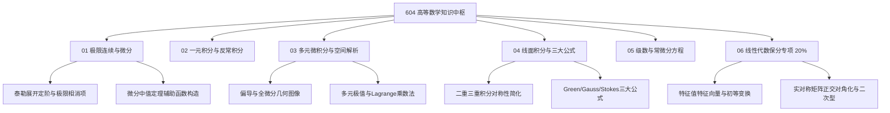

# 604 高等数学全局知识图谱 (Mathematics MOC)

> **科目代码**：604 高等数学（中国科学院大学统一命题，180分钟闭卷，满分 150 分）  
> **试卷结构**：**微积分约 80% (120分) + 线性代数约 20% (30分)**  
> **认知学习法则**：拒绝死背公式，坚持**“适用条件红线 $\to$ 几何直觉 $\to$ 白纸算力手推到底”**。

---

## 🗺️ 604 高等数学六大核心板块拓扑

---

## 📂 模块精讲与核心知识卡片索引

### [[01_极限连续与微分]] (权重: ~15%)
- **大纲核心**：数列与函数极限、夹逼准则、无穷小比较、连续与间断点、高阶导数与 Leibniz 公式、微分中值定理（Rolle/Lagrange/Cauchy）。
- **重点卡片**：
  - [[泰勒展开定阶与极限相消项]] —— 攻克“相消项展开到第几阶”的致命盲区。
  - [[一致连续性判定方法与闭区间均匀覆盖定理]] —— 闭区间一致连续Cantor定理与导数无界判定。
  - [[微分中值定理构造辅助函数法]] —— 罗尔定理辅助函数万能积分法与证明断点。

### [[02_一元积分与反常积分]] (权重: ~15%)
- **大纲核心**：不定积分三大换元与分部积分法、定积分性质与变上限积分求导、反常积分敛散性审敛（比较审敛法与极限审敛法）。
- **重点卡片**：
  - [[定积分物理应用_弧长引力压力功]] —— 弧长、侧面积、功、水压力微元法建立与积分。
  - `变上限积分奇偶性与周期性定理`
  - `反常积分 $p$-审敛标准模型与等价替代`

### [[03_多元微积分与空间解析]] (权重: ~15%)
- **大纲核心**：空间平面与直线方程、二次曲面标准方程、多元连续/可偏导/可微关系、方向导数与梯度、无条件极值（Hessian 矩阵）与条件极值（Lagrange 乘数法）。
- **重点卡片**：
  - [[二元Taylor公式与多元极值充分条件]] —— 极值二阶充分条件与 Hessian 矩阵判别式。
  - `多元函数连续/偏导/全微分关系判别全景图`
  - `Lagrange乘数法求最值的几何本质与边界判别`

### [[04_线面积分与三大公式]] (权重: ~20% · 国科大必考压轴)
- **大纲核心**：二重积分直角/极坐标、三重积分（柱面/球面坐标变换与形心公式）、第一/二类曲线曲面积分、Green 公式、Gauss 公式、Stokes 公式、散度与旋度。
- **重点卡片**：
  - `二重三重积分奇偶性与轮换对称性秒杀技巧`
  - `第二类曲面积分三大战法：直接投影法、Gauss补面法、参数转换法`

### [[05_级数与常微分方程]] (权重: ~15%)
- **大纲核心**：正项级数审敛（比值/根值/积分审敛法）、交错级数 Leibniz 判别、幂级数收敛半径/和函数求解、一阶微分方程（可分离/一阶线性）、高阶常系数线性微分方程与 Euler 方程。
- **重点卡片**：
  - [[Bernoulli方程换元法与全微分方程]] —— 伯努利方程一阶换元与全微分判定及原函数。
  - [[微分方程简单应用_增长衰变混合模型]] —— 指数衰变、牛顿冷却、容器混合与正交轨线族。
  - `幂级数和函数求和：微分后求和 vs 积分后求和`
  - `二阶常系数非齐次线性微分方程特解设法判定律`

### [[06_线性代数_保分专项]] (权重: ~20% · 30分必须全拿)
- **大纲核心**：行列式性质与展开、矩阵初等变换与秩、向量组线性相关性与 Schmidt 正交化、非齐次方程组解的结构与通解、特征值与特征向量、相似对角化、实对称矩阵正交相似对角化、二次型标准化（配方法与正交变换法）、正定矩阵判定。
- **重点卡片**：
  - [[实对称矩阵正交相似对角化与二次型规范化]] —— 国科大线代大题标配母题，四步模板法。
  - [[Cramer法则与行列式解方程组]] —— 克莱姆唯一解判定与齐次方程非零解。

---

## ⚡ 604 高数解题 3 大红线原则
1. **展开必有依据**：泰勒展开必须先说明展开点与余项阶数 $o(x^n)$；
2. **算到具体数值**：极限、积分绝不可停留在未化简的表达式；
3. **草稿纸严格分区**：草稿纸折成四格，禁止飞沙走石，严防抄错负号与幂次！
