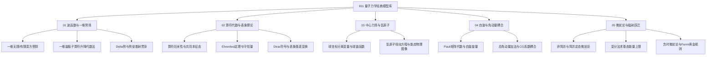

# 811 量子力学经典模型全局图谱 (Quantum Mechanics MOC)

> **科目代码**：811 量子力学（中国科学院大学统一命题，180分钟闭卷，满分 150 分）  
> **试卷结构**：**5 道大计算推导题（每题 30 分）**  
> **核心战法**：物理情景 $\to$ 边界条件 $\to$ 构建哈密顿量 $\hat{H}$ $\to$ 算符表象推导 $\to$ 物理图像与量纲/极限自检。

---

## 🗺️ 811 量子力学五大经典物理模型拓扑

---

## 📂 模块经典模型与核心卡片索引

### [[01_波函数与一维势场]] (必考基础)
- **大纲核心**：概率流密度与连续性方程、有限/无限深势阱能级与节点定理、$\delta$ 势函数跳变条件、一维谐振子能量与波函数。
- **重点卡片**：
  - [[一维无限深方势阱与对称性宇称]] —— 基准与对称模型对比、宇称分类、严格归一化代数、节点定理与动量期望值。
  - [[一维谐振子算符升降代数法]] —— 升降算符 $[a, a^\dagger]=1$ 代数法全解析。
  - [[圆环粒子运动_周期性边界条件与能级简并]] —— 周期边界的二重能级简并与算符表示。
  - [[一维有限深对称方势阱超越方程与图解法]] —— 宇称分类、超越方程、无量纲画圆图解法与束缚态数目判定。
  - [[一维Delta势阱束缚态与导数跃变条件]] —— $\delta$ 势场导数阶跃条件、束缚态唯一性与几率流密度。
  - [[一维阶梯势垒散射与几率流守恒]] —— 单界面匹配、反射系数 $R$、透射系数 $T$（含速度比修正）与几率流守恒。
  - [[一维势垒贯穿与量子隧道效应]] —— 矩形方势垒、透射系数 $T$ 与反射系数 $R$、Gamow 衰减与共振透射。

### [[02_算符代数与表象理论]] (推导核心)
- **大纲核心**：算符代数运算与对易关系、测不准关系、厄米算符完备性、守恒量与对称性、Ehrenfest 定理、Dirac 符号、坐标/动量表象变换。
- **重点卡片**：
  - [[Heisenberg图像与算符时间演化方程]] —— 算符演化方程、Heisenberg运动方程与Ehrenfest定理。
  - [[算符指数对易子与BCH展开_平移生成元]] —— $[\hat{A}, e^{\hat{B}}]$ 恒等式、BCH 展开与平移生成元。
  - [[动量表象波函数与空间势阱傅里叶变换_单缝衍射图像]] —— 坐标到动量表象傅里叶变换、欧拉拆解与单缝衍射动量谱。

### [[03_中心力场与氢原子]] (经典大题常客)
- **大纲核心**：中心对称势场分离变量、轨道角动量算符 $\hat{L}^2, \hat{L}_z$ 与球谐函数、径向薛定谔方程、库仑势下氢原子能谱与主量子数/角量子数简并度。
- **重点卡片**：
  - [[氢原子径向方程与能态物理图像]] —— 径向有效势能、玻尔半径与主副量子数物理本质。
  - [[球形方势阱与三维各向同性谐振子]] —— 三维各向同性谐振子笛卡尔分离变量与球形方势阱。
  - [[三维谐振子粒子数表象与多维微扰矩阵元]] —— 三维各向同性谐振子高维矩阵元计算微扰方法。

### [[04_自旋与角动量耦合]] (高频必杀大题)
- **大纲核心**：电子自旋假说、Pauli 自旋矩阵与对易/反易代数、自旋单态与三重态、总角动量加法 $\mathbf{J} = \mathbf{L} + \mathbf{S}$、Clebsch-Gordan (CG) 系数表查法与直接推导。
- **重点卡片**：
  - [[自旋轨道耦合精细结构与超精细结构]] —— 轨道角动量自旋耦合、精细与超精细结构能级分裂。
  - [[自旋纠缠态Bell态与不可分辨判别]] —— 自旋单态与三重态的Bell态正交基底、因式分解判定。
  - `Pauli自旋矩阵反易恒等式与磁矩进动方程`
  - `两体自旋1/2耦合为单态三重态投影推导`

### [[05_微扰论与辐射跃迁]] (压轴决胜大题)
- **大纲核心**：非简并定态微扰一级能量/波函数修正与二级能量修正、简并微扰久期方程 (Secular Equation)、变分原理与基态试验波函数构造、含时微扰、Fermi 黄金规则、偶极跃迁选择定则。
- **重点卡片**：
  - [[Hellmann-Feynman定理与Virial定理]] —— HF参数求导与Virial力学量期望值比率。
  - [[氦原子变分法基态能量近似]] —— 屏蔽电荷模型与二电荷氦原子变分法。
  - [[突发微扰_势场突变与谐振子频率跃变]] —— 突发近似跃迁概率、高斯波包重叠积分。
  - `非简并与简并微扰久期矩阵元统一解法`
  - `Fermi黄金规则与偶极跃迁选择定则本质`

---

## 🏆 811 理论物理推导踩分规范
1. **先写情景后写式**：先画出势场图像，标注各区域波函数符号与边界条件；
2. **中间矩阵元保留原式**：如 $\langle n | \hat{x}^2 | n \rangle$，写出由 $a + a^\dagger$ 展开的过程；
3. **极限量纲必须自检**：推导出的公式最后必须代入极限值（如 $a \to \infty$ 或 $\hbar \to 0$）检验合理性！
