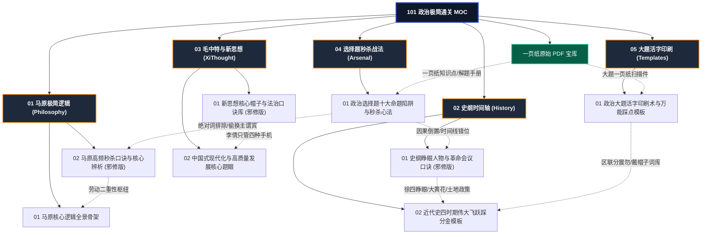

# 101 思想政治理论极简通关攻坚 (Politics Master MOC)

> **科目代码**：101 思想政治理论（全国统考，满分 100 分）  
> **试卷结构**：单选题 16 分 + 多选题 34 分 + 分析题 50 分（共 5 大题，每题 10 分）  
> **战略原则**：**“选择题定生死（靠邪修秒杀），分析题靠活字印刷（考前押题）”**。绝不让政治占用数理主科的黄金时间，用最精简的高频口诀与模板，以最小精力稳拿 70+ 分！

---

## 🌐 一、 政治知识库与邪修秒杀全景关系网络图 (Knowledge Graph)

---

## 🧭 二、 五大邪修模块速查传送门

### 1. 【01 马原极简逻辑】（重在哲学辩证逻辑与政经基石）
- 📄 [[01_马原极简逻辑_Philosophy/01_马原核心逻辑全景骨架|马原核心逻辑全景骨架.md]]：唯物论、辩证法、认识论、唯物史观体系框架。
- ⚡ [[01_马原极简逻辑_Philosophy/02_马原高频秒杀口诀与核心辨析_邪修版|马原高频秒杀口诀与核心辨析 (邪修版).md]]：`【牢二枢纽】`（劳动二重性）、`【是2必】`（科学社会主义两个必然）、物质统一性。

### 2. 【02 史纲时间轴与口诀】（重在“第一”、会议转折与土地政策）
- ⚡ [[02_史纲时间轴与口诀_History/01_史纲睁眼人物与革命会议秒杀口诀_邪修版|史纲睁眼人物与革命会议秒杀口诀 (邪修版).md]]：`【徐四睁眼见阎王喂海狮 郑观应是公主】`、同盟会起义`【大黄花】`、清末新政`【撤绿立新】`、中共历次重大会议与土地政策演进。
- 🏆 [[02_史纲时间轴与口诀_History/02_中国近代史四时期伟大飞跃踩分金模板|中国近代史四时期“伟大飞跃”踩分金模板.md]]：旧民主主义救国无门 $\to$ 共产党百年奋斗四大历史时期与伟大飞跃（大题必背金段）。

### 3. 【03 毛中特与新思想】（重在“帽子”定位词与法治闭环）
- ⚡ [[03_毛中特与新思想_XiThought/01_新思想核心帽子与法治口诀库_邪修版|新思想核心帽子与法治口诀库 (邪修版).md]]：全面依法治国`【李倩只管四种手机】`、权利保障`【县里行司，前要管后】`、总体国家安全观五要素。
- 🌟 [[03_毛中特与新思想_XiThought/02_中国式现代化与高质量发展核心题眼|中国式现代化与高质量发展核心题眼.md]]：五大中国特色、九个本质要求、新质生产力核心定位。

### 4. 【04 选择题秒杀战法与排雷】（多选题多拿 10 分的秘籍）
- 💣 [[04_选择题秒杀战法与排雷_Arsenal/01_政治选择题十大命题陷阱与秒杀心法|政治选择题十大命题陷阱与秒杀心法.md]]：四大秒杀绝对词（95% 直接打叉）、六大偷换陷阱（偷换范围、张冠李戴、因果倒置）。

### 5. 【05 大题活字印刷与模板】（分析题无需死记，考场直接组合）
- 🖨️ [[05_大题活字印刷与模板_Templates/01_政治大题活字印刷术与万能踩点模板_一页纸版|政治大题活字印刷术与万能踩点模板 (一页纸版).md]]：双概念水字数万能骨架`【区联分展勿】`、设问“为什么要 A”戴帽子词库、大题三步破局法。

---

## 📚 三、 原始 PDF 宝库索引 (`一页纸/`)

- 📘 [[一页纸/26考研政治大题一页纸(2025-12-13-18-30-35)_withMarginNotes.pdf|26考研政治大题一页纸 (带批注版)]]
- 📗 [[一页纸/【框图版】一页纸-知识点手册.pdf|【框图版】一页纸-知识点手册 (115页完整版)]]
- 📕 [[一页纸/考研政治一页纸—解题方法手册.pdf|考研政治一页纸—解题方法手册 (37页排雷指南)]]
- 📙 [[一页纸/马原(1).pdf|马原口诀一页纸]] ｜ [[一页纸/史纲(1).pdf|史纲口诀一页纸]] ｜ [[一页纸/新思想(1).pdf|新思想口诀一页纸]]
